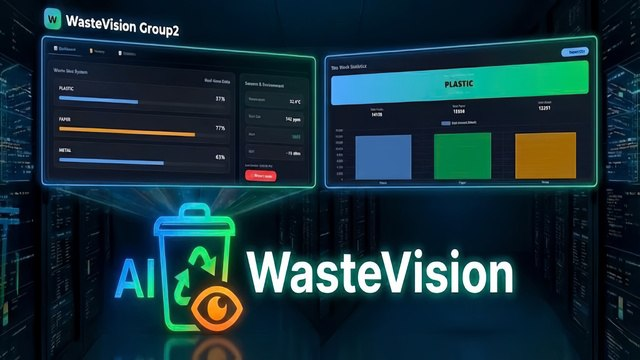

# ♻️ WasteVision AI

> **Smart Waste Classification & Monitoring System** — Group 2 | FPT University



[](https://python.org)
[](https://flask.palletsprojects.com)
[](https://keras.io/api/applications/resnet/)
[](https://www.espressif.com)
[](LICENSE)

🇬🇧 English &nbsp;|&nbsp; [🇻🇳 Tiếng Việt](./README.vi.md)

---

## 📖 Overview

**WasteVision AI** is an intelligent waste classification and monitoring system that combines Computer Vision, IoT, and a real-time Web Dashboard. The system automatically sorts waste at the source with over **90% accuracy**, minimizing human error and improving overall waste management efficiency.

### 🎯 Project Objectives

- Automate waste classification at the point of disposal
- Achieve classification accuracy **>90%**
- Reduce human involvement and sorting errors
- Enable real-time environmental monitoring and safety alerts

---

## ✨ Key Features

| Feature | Description |
|---------|-------------|
| 🤖 **AI Classification** | Classifies Plastic / Paper / Metal using ResNet50 |
| ⚙️ **Auto Sorting** | Servo-driven mechanical sorting (0° / 115° / 190°) |
| 📡 **IoT Monitoring** | Real-time fill level, temperature & toxic gas tracking |
| 🌐 **Web Dashboard** | Intuitive interface with Chart.js weekly statistics |
| 🔔 **Smart Alerts** | Local (Buzzer, LCD) and remote (Telegram Bot) notifications |
| 🔍 **Explainability** | Grad-CAM heatmap visualization for AI decisions |

---

## 🏗️ System Architecture

```
┌─────────────┐    Image    ┌─────────────┐    Result   ┌─────────────┐
│  ESP32-S3   │ ──────────► │  AI Server  │ ──────────► │  Web Server │
│  (Hardware) │             │  (ResNet50) │             │   (Flask)   │
└──────┬──────┘             └─────────────┘             └──────┬──────┘
       │                                                        │
       │ Sensor Data (HTTP)                             REST API│
       │                                                        │
┌──────▼──────┐                                         ┌──────▼──────┐
│   Sensors   │                                         │  Dashboard  │
│ Ultrasonic  │                                         │  Chart.js   │
│ MQ2 / DHT11 │                                         │  Telegram   │
│ IR Array    │                                         └─────────────┘
└─────────────┘
```

### 🔧 Hardware Stack

| Component | Detail |
|-----------|--------|
| **MCU** | ESP32-S3 |
| **Camera** | OV2640 |
| **Sensors** | HC-SR04 (ultrasonic), MQ-2 (gas/smoke), DHT11 (temp/humidity), IR array |
| **Actuators** | Servo motor × 2, Buzzer, ILI9341 TFT LCD |
| **Sorting angles** | Plastic → 0° · Paper → 115° · Metal → 190° |

### 🧠 AI Stack

- **Model**: ResNet50 (transfer learning, ImageNet pre-trained)
- **Framework**: TensorFlow / Keras
- **Augmentation**: HorizontalFlip, VerticalFlip, Rotate, BrightnessContrast, ColorJitter, Coarse Dropout
- **Train/Test split**: 80% / 20%
- **Explainability**: Grad-CAM

### 🌐 Software Stack

- **Backend**: Python, Flask
- **Frontend**: HTML / CSS / JS, Chart.js
- **Notification**: Telegram Bot API
- **Firmware**: Arduino C++ (ESP32-S3)

---

## 📊 Dataset

| Class | Train | Test | Total | Distribution |
|-------|------:|-----:|------:|:------------:|
| Metal | 851 | 213 | 1,064 | 34.1% |
| Paper | 917 | 230 | 1,147 | 36.7% |
| Plastic | 729 | 183 | 912 | 29.2% |
| **Total** | **2,497** | **626** | **3,123** | 100% |

---

## 📈 Results

| Class | Confidence Range |
|-------|-----------------|
| Plastic | 99.83% — 100.00% |
| Metal | 94.59% — 98.36% |
| Paper | 93.21% — 95.49% |

- System achieves **>90% accuracy** on the test set
- Real-time alert triggers correctly at bin fill level ≥ 92%
- Processing time per item: ~4.5 seconds (capture → classify → sort)

---

## 🔄 System Workflow

```
IR Sensor detects waste object
          │
          ▼
  3-second verification (anti-spam)
          │
          ▼
  Camera captures image → Sends to AI Server
          │
          ▼
  ResNet50 classifies → Plastic / Paper / Metal
          │
          ▼
  Servo rotates to target angle → Door opens → Wait 4.5s → Door closes
          │
          ▼
  Dashboard updated + Log recorded
          │
          ▼
  System ready for next cycle
```

---

## 🚀 Getting Started

### Prerequisites

- Python 3.8+
- Arduino IDE (to flash ESP32-S3 firmware)
- Telegram Bot Token

### 1. Clone the repository

```bash
git clone https://github.com/<your-username>/WasteVision-AI.git
cd WasteVision-AI
```

### 2. Install dependencies

```bash
pip install -r requirements.txt
```

### 3. Download AI Model

> ⚠️ The `ai/` folder (trained model weights & related files) is **not included in this repository** due to file size constraints.

**Download it from Google Drive:**

### 📁 [Click here to download the AI folder](https://drive.google.com/drive/folders/1YwfRfeoxepan-EBAGZU-itxA6FhUekhH?usp=sharing)

After downloading, place the contents into the project as follows:

```
WasteVision-AI/
└── ai_server/
    └── model/
        ├── resnet50_waste.h5      ← place here
        └── ...
```

### 4. Environment Configuration

Create a `.env` file at the project root:

```env
TELEGRAM_BOT_TOKEN=your_bot_token
TELEGRAM_CHAT_ID=your_chat_id
ESP32_IP=192.168.x.x
FLASK_SECRET_KEY=your_secret_key
```

**ESP32 Configuration:**
- Open file `Source Code/IOT/main.cpp`
- Change `YOUR_WIFI_SSID` and `YOUR_WIFI_PASSWORD` to your WiFi credentials

### 5. Run the AI Server

```bash
cd ai_server
python app.py
```

### 6. Run the Web Server

```bash
cd web_server
python app.py
```

### 7. Flash ESP32-S3 Firmware

Open `firmware/wastevision_esp32/wastevision_esp32.ino` in Arduino IDE and upload to the board.

---

## 📁 Project Structure

```
WasteVision-AI/
├── ai_server/              # AI classification server (Flask + ResNet50)
│   ├── app.py
│   └── model/              # ← Place downloaded AI model here
├── web_server/             # Web dashboard (Flask)
│   ├── app.py
│   ├── templates/
│   └── static/
├── firmware/               # ESP32-S3 Arduino firmware
│   └── wastevision_esp32/
├── assets/                 # Images, diagrams
├── requirements.txt
├── .env.example
├── README.md               # English (this file)
└── README.vi.md            # Vietnamese
```

---

## ⚠️ Limitations & Future Work

### Current Limitations

- **Single-View Dependency**: Fixed camera angle can misclassify visually similar objects
- **Angle Bias**: Bottom of cans (resembles a cap) or labels (resembles paper) may confuse the model
- **Environmental Sensitivity**: Accuracy may decrease under poor lighting or with partially obscured items

### Future Roadmap

- [ ] **Multi-view Vision** — Add extra cameras or mirrors for 360° perspective
- [ ] **Dataset Expansion** — Diverse, close-up, multi-angle images for better robustness
- [ ] **System Reliability** — Enhanced accuracy for complex real-world environments
- [ ] **Mobile App** — Remote monitoring via smartphone
- [ ] **Multi-bin Support** — Monitor multiple waste bins simultaneously

---

## 👥 Team Members

| Name | Student ID | Role |
|------|-----------|------|
| Chau Quoc Inh | CE190593 | Team Lead |
| Tran Minh Phuoc | CE190754 | Hardware / Firmware |
| Luu Huu Binh | CE200315 | AI / ML |
| Tran Nguyen Thien Thanh | CE200089 | Web Backend |
| Nguyen Huu Phat | CE200437 | Web Frontend |

---

## 🏫 Academic Info

- **University**: FPT University, Can Tho Campus
- **Course**: Software Engineering Fundamentals
- **Semester**: Spring 2025

---

## 📄 License

This project is distributed under the [MIT License](LICENSE).

---

<p align="center">
  <strong>WasteVision AI — Group 2 | FPT University</strong><br>
  <em>Building a cleaner future, one piece of waste at a time 🌿</em>
</p>
